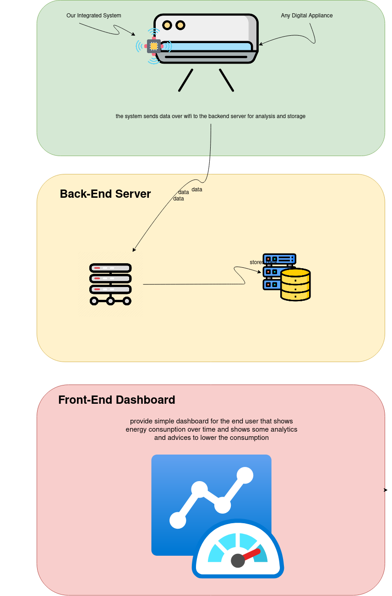
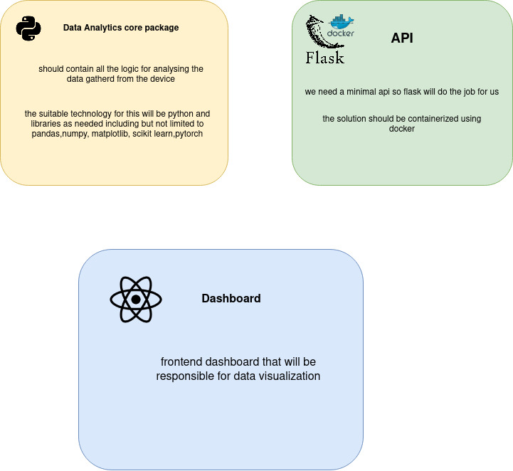

**System design task**
**Author: Tarik Waleed**
# Energy Management System

**Software Requirements**

>i'll assume that the embeded software is attached to the appliance and doing its job and sending data to the backend server for analysis and storage

- design and implement user management system to keep track of users/client and their registered devices in the system
- raw data collected from the device should be arranged reformatted and stored in storage for data analysis.
- design real time dashboard that will visualize the energy consumption of each registered devices by the user

**MVP**
- the mvp should at least contains real time gear or pie chart that shows the energy and power consumption
- `technologies`: the frontend framework will be the one that our team is familiar with for example react.
- we will use data visualizatin libraries like `d3.js` or `charts.js`
- `time estimation` is two weeks to just launch the dashboard with fake data or API 

**software architecture**

**Back-end tasks**

- [ ] `Setup Development Environment:`
  - Install Python, Flask, and necessary dependencies.
  - Create a virtual environment for the project.

- [ ] `Setup Staging Server:`
  - Configure a staging server environment for testing.

- [ ] `Initialize Flask App:`
  - Create a basic Flask application structure.
  - Set up necessary files (e.g., `app.py`, `requirements.txt`).

- [ ] `Define API Endpoints:`
  - Design and define API endpoints based on requirements.
  - Include routes for user management, device registration, and data retrieval.

- [ ] `API Documentation:`
  - Generate clear and concise documentation for API endpoints.

- [ ] `Unit Testing:`
  - Write unit tests for API endpoints and functions.
  - Ensure comprehensive test coverage.

- [ ] `Implement Logging:`
  - Set up logging mechanisms for tracking important events.

**Front-End Tasks**
- [ ] `Setup Frontend Project:`
  - Initialize a new frontend project using a framework of choice (e.g., React, Angular, Vue).
  - Set up the project structure and essential files.

- [ ] `Install Dependencies:`
  - Install necessary frontend dependencies using a package manager (e.g., npm or yarn).
  - Include libraries for data visualization if needed.

- [ ] `Design Dashboard Wireframes:`
  - Collaborate with UI/UX designers to create wireframes for the real-time dashboard.
  - Define the layout, components, and user interactions.

- [ ] `Implement Dashboard Components:`
  - Develop and style the basic components of the dashboard, including charts, graphs, and user controls.
  - Ensure responsiveness for different screen sizes.

- [ ] `Integrate API Endpoints:`
  - Connect the frontend to the backend API endpoints.
  - Implement functions to fetch and display user-specific data on the dashboard.

- [ ] `Real-Time Updates:`
  - Implement mechanisms to handle real-time updates on the dashboard.

- [ ] `Unit Testing:`
  - Write unit tests for individual components and functions.
  - Ensure that each component behaves as expected.

